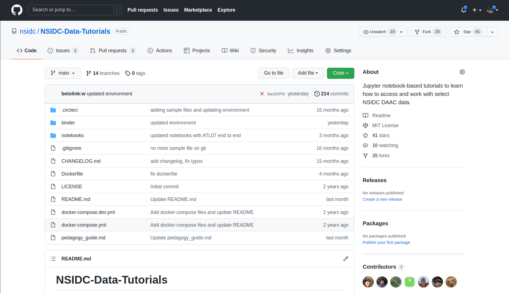
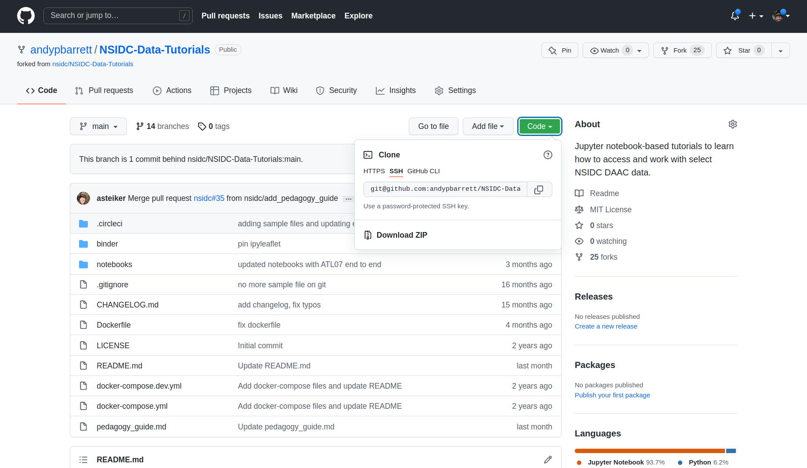
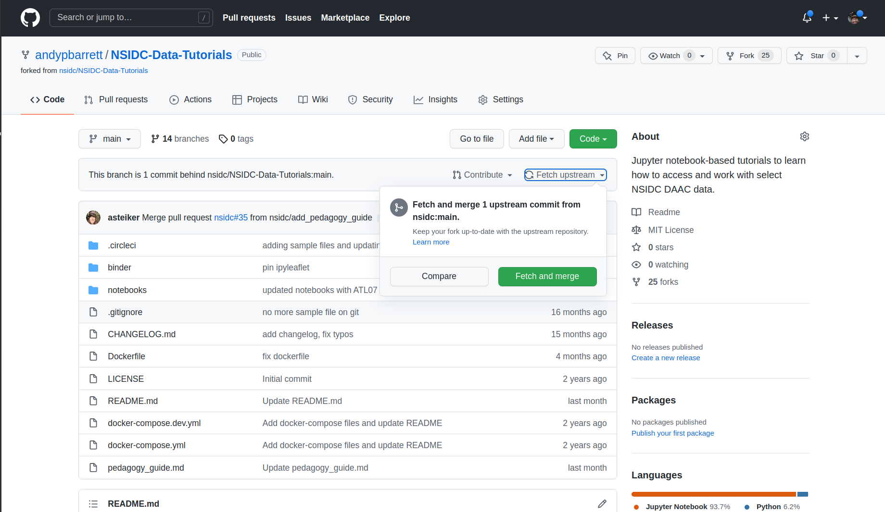

# Contribution Guide

## Ways to contribute

We welcome contributions in many forms;  
- Share a use case, example or idea for a new tutorial
- Submit a new tutorial
- Update an existing tutorial
- Submit bug reports and feature requests
- Fix typos
- Add documentation

If you would like to contribute, check the _Issues_ by clicking on the _Issues_ tab.
Someone might already have a similar idea.  If not, then create a new issue and submit your suggestion.

Please read our [code of conduct](CODE_OF_CONDUCT.md)

## How to contribute

We follow a __Forking Workflow__.  This approach allows contributions from outside of NSIDC.

A detailed recipe for contributing using the __Forking Workflow__ is given below.  However, to orient you and provide a roadmap, the workflow is described here briefly.   

In a __Forking Workflow__ the `nsidc/NSIDC-Data-Tutorials` repository is _Forked_ creating a "copy" under a your
private repository; e.g. `<your_github_username>/NSIDC-Data-Tutorials`, where `<your_github_username>` is your github name.  This "copy" is just a `git clone` of
`nsidc/NSIDC-Data-Tutorials`.  To add content or make changes to existing content, you follow a __Branching Workflow__; create a branch,
do some work, commit the changes, and push work to your private repository
(`<your_github_username>/NSIDC-Data-Tutorials`).  Once you have completed the work, you then create a pull request, which, once approved, is
merged into the central `nsidc/NSIDC-Data-Tutorials`.

An alternative description of a __Forking Workflow__ can be found [here](https://www.asmeurer.com/git-workflow/).
A more in depth discussion of the __Forking Workflow__ can be found
[here](https://www.atlassian.com/git/tutorials/comparing-workflows/forking-workflow)

### Fork the `nsidc/NSIDC-Data-Tutorials` repository

Forking creates a copy of the official `NSIDC-Data-Tutorials` repository as a personal repository with the same name.  You can add new content and make changes to this _forked_ repository.  These changes will not be made in the official repository until you create a _pull request_.

To _Fork_ the `nsidc/NSIDC-Data-Tutorials` click on the Fork button in the top right corner of the main repo web page.  This will automatically create a repo `<your_github_username>/NSIDC-Data-Tutorials`.



### Clone your private repository

The forked repository `<your_github_username>/NSIDC-Data-Tutorials` needs to be cloned to your local machine.  To do this, click on the green _Code_ button in the forked repository and copy the repository url. 



This url will be `git@github.com:<your_github_username>/NSIDC-Data-Tutorials.git`

Then on your local machine type.  You can just paste in the repository url.

```
$ git clone git@github.com:<your_github_username>/NSIDC-Data-Tutorials.git
```

This creates a directory `NSIDC-Data-Tutorials`.  `cd` into the NSIDC-Data-Tutorials directory.  You are now ready to create new content or make changes.


### Get any changes made to the remote repo

Each time you start a new feature or notebook, it is __best-practice__ to pull any changes from the official remore repository.  This is done in two steps.

- _Fetch_ changes to the official repo by clicking on the _Fetch upstream_ button.  If there are changes to fetch, the green _Compare and merge_ button will be highlighted.  Click this button.  Your private remote repo is now up-to-date with the official repo.



- Now you have to __pull__ those changes to your local repo.

```
$ git checkout main  # Make sure you are on the main branch
$ git pull           # Fetch and merge changes 
```

### Create a new branch

Creating a new local branch ensures that development work is kept separate from the `main` branch.  Once the new feature or tutorial is complete and free from error, it can be merged with the main branch.

A step-by-step sequence of commands to create a new branch is below.

```
$ git branch                    # this lists branches
$ git branch new_feature        # create a new branch
$ git checkout new_feature      # switch to new_branch
$ git branch                    # You should see the new branch highlghted in green or with an asterisk to show that is the
                                # branch you are on
```

This can also be done in a single command.

```
$ git checkout -b new_branch
```

You are now ready to add a new notebook or do some other work.

### Do some work

Creating a new notebook, adding new code or documentation, and making changes follow a sequence of steps.

```
<Do some work>
$ git add <new_or_modified_file>                     # Stage a file or files
$ git commit -m 'a short note saying what was done and why'  # commit those files
<Do some more work>
$ git add <new_or_modified_file>
$ git commit -m 'a short note saying what was done and why'
.
.
.
```

The idea is that commits provide a checkpoint for work done to a repo.  The messages tell other developers what has been done.  If necessary, those commits can be discarded or the repo __rewound__ to undo those changes.  Because of this, it is best to keep commits relatively small and atomic.

### Push work to private repository
When you are ready to share your work you push it to your forked copy of the main repo.  

```
$ git push origin new_branch
```

### Create a pull request
Creating a pull request notifies other developers that you have new work to merge into the main branch.

Usually you will see a _Make Pull Request_ button in the branch of your forked repo.

Click this button.  You will be given options of branches to compare your new_branch with.  Usually this will be the `main` branch.  Add a description of what you have done to help other developers review your work.  You can also assign reviewers.

Reviewers then review your work.  They may suggest some changes or fixes.

You can continue to push changes to the pull request until it is merged.  That way you can make changes, fix typos etc.

Once everyone is happy, the pull request is merged.

It is good practice to delete the new_branch once the pull request has been merged.

Happy Coding!
